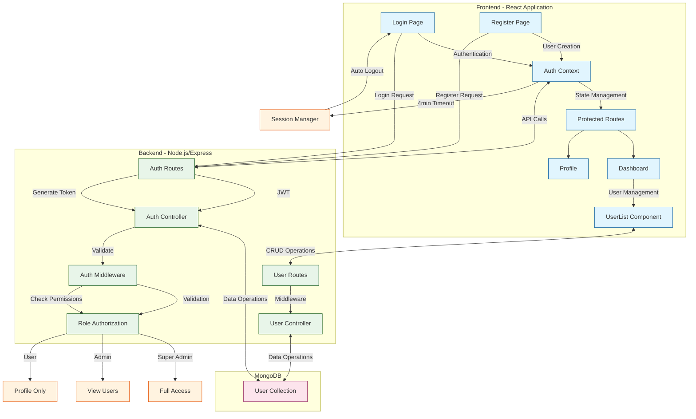

# RBAC Authentication System Workflow

## Workflow Description

### Frontend Flow

1. **Authentication**

   - Users can login or register through dedicated pages
   - AuthContext manages authentication state and session
   - Protected routes ensure authenticated access

2. **User Interface**
   - Dashboard displays user management for admin roles
   - Profile page for user information updates
   - Role-based component rendering

### Backend Flow

1. **API Routes**

   - Authentication routes handle login/register
   - User routes manage CRUD operations
   - Protected routes require JWT validation

2. **Middleware**
   - JWT verification for protected routes
   - Role-based access control
   - Session timeout management

### Database Flow

1. **User Management**
   - Store user credentials and profiles
   - Maintain role associations
   - Handle data persistence

### Security Features

1. **Authentication**

   - JWT-based authentication
   - Password hashing with bcrypt
   - Email validation for Gmail

2. **Authorization**

   - Role-based access control
   - Permission validation
   - Protected route middleware

3. **Session Management**
   - 4-minute session timeout
   - Automatic logout
   - Activity-based session refresh
